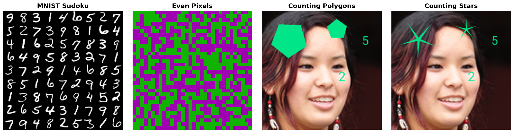
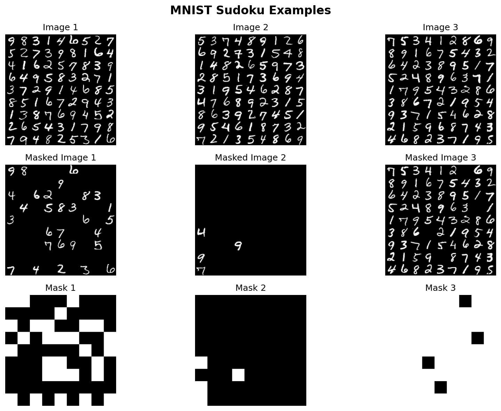
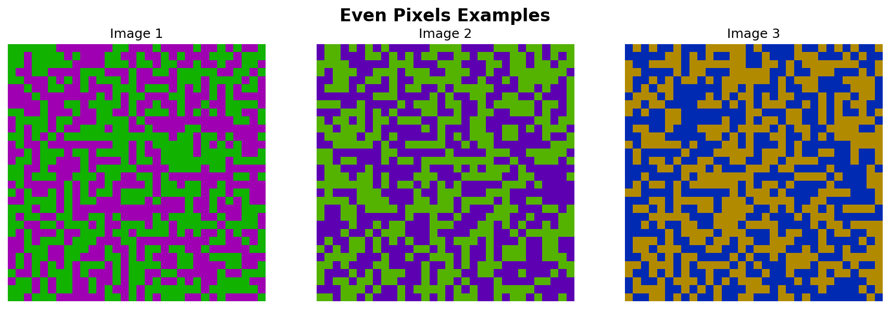
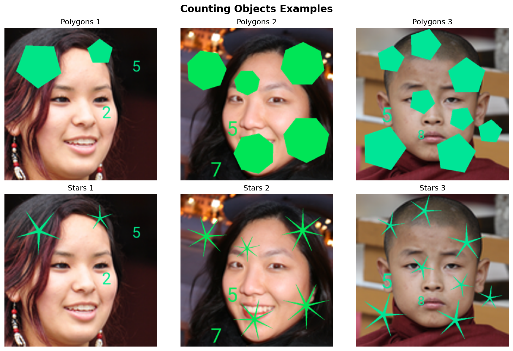

# SRM Benchmarks

[](https://pypi.org/project/srmbench/)
[](https://pypi.org/project/srmbench/)
[](https://opensource.org/licenses/MIT)
[](https://github.com/spatialreasoners/srmbench/actions)
[](https://arxiv.org/abs/2502.21075)
[](https://geometric-rl.mpi-inf.mpg.de/srm/)

A minimalistic package with **benchmark datasets** and **evaluation metrics** to see how good is your image generative model at understanding **complex spatial relationships**. Those are the datasets used in the ICML 2025 paper [Spatial Reasoning with Denoising Models](https://geometric-rl.mpi-inf.mpg.de/srm/). All the dataset files and evaluation models have been deployed in their minimal forms to Huggingface, and will be downloaded **automatically** when you use the package.

<p align="center">
  
</p>

## Installation
### From PyPI
```bash
pip install srmbench
```

### From source
```bash
git clone https://github.com/spatialreasoners/srmbench.git
cd srmbench
pip install -e .
```

### Development installation
```bash
git clone https://github.com/spatialreasoners/srmbench.git
cd srmbench
pip install -e ".[dev]"
```

## Datasets

SRM Benchmarks provides three main datasets for evaluating spatial reasoning capabilities in generative models. Each dataset tests different aspects of spatial understanding and constraint satisfaction.

### 🧩 MNIST Sudoku

<p align="center">
  
</p>

**Challenge**: Inpaint the image by filling the missing cells with MNIST digits where no digit repeats in any row, column, or 3×3 subgrid.

**What the model needs to understand:**
- **Global constraints**: Sudoku validity rules that span the entire image
- **Spatial relationships**: Row, column, and subgrid membership
- **Digit recognition**: Understanding and generating MNIST digits correctly
- **Constraint propagation**: How placing one digit affects valid placements elsewhere

**Dataset Details:**
- **Image size**: 252×252 pixels (9×9 grid of 28×28 MNIST digits)
- **Format**: Grayscale images with corresponding masks
- **Masks**: Indicate which cells are given (black) vs. need to be filled (white)
- **Difficulty**: Configurable via `min_given_cells` and `max_given_cells` parameters

**Evaluation Metrics:**
- `is_valid_sudoku`: Boolean indicating valid Sudoku (no duplicates in any row/column/subgrid)
- `duplicate_count`: Number of constraint violations (0 = perfect)

---

### 🎨 Even Pixels

<p align="center">
  
</p>

**Challenge**: Generate images where exactly 50% of pixels are one color and 50% are another color, with uniform saturation and brightness.

**What the model needs to understand:**
- **Pixel-level counting**: Precise balance between two colors
- **Global distribution**: Maintaining exact 50/50 split across entire image
- **Color consistency**: Uniform saturation and value (HSV color space)
- **Statistical properties**: Perfect balance down to the pixel level

**Dataset Details:**
- **Image size**: 32×32 pixels (1,024 total pixels)
- **Format**: RGB images
- **Color constraint**: There are two colors in the image (with opposite hue values), randomly positioned, but the count of pixels for each color is exactly 50% of the total number of pixels.

**Evaluation Metrics:**
- `saturation_std`: Standard deviation of saturation (should be ~0)
- `value_std`: Standard deviation of brightness (should be ~0)
- `color_imbalance_count`: Deviation from perfect 50/50 split (0 = perfect)
- `is_color_count_even`: Boolean for exact pixel balance (1.0 = perfect)

---

### 🔢 Counting Objects

<p align="center">
  
</p>

**Challenge**: Generate images with a specific number of objects (polygons or stars) where the displayed numbers match the actual object counts.

**What the model needs to understand:**
- **Object counting**: Generating exact numbers of distinct objects
- **Number placement**: Positioning numbers that accurately represent counts
- **Object consistency**: All objects having the same number of vertices (uniform constraint)
- **Semantic coherence**: Numbers matching what's visually present

**Dataset Details:**
- **Image size**: Configurable (typically 128×128 or 256×256)
- **Format**: RGB images with objects overlaid on FFHQ background faces
- **Variants**: 
  - **Polygons**: 3-9 sided polygons
  - **Stars**: 4-10 pointed stars
- **Numbers**: Optional overlay showing object counts (via `are_nums_on_images` parameter)

**Evaluation Metrics:**
- `are_vertices_uniform`: Fraction where all objects have same vertex count
- `numbers_match_objects`: Fraction where displayed numbers match actual counts
- `relative_vertex_count_N`: Distribution of N-vertex objects
- `relative_polygons_count_N`: Distribution of N objects
- Confidence scores: Model's certainty in predictions

---

## Usage

### Available Datasets

SRM Benchmarks provides three main datasets for evaluating spatial reasoning capabilities:
- **MNIST Sudoku**: Sudoku puzzles with MNIST digits
- **Even Pixels**: Images with specific color distribution constraints
- **Counting Objects**: Images with polygons or stars to count (with optional numbers overlay)

### Quick Start

#### 1. MNIST Sudoku Dataset

```python
import torch
from torch.utils.data import DataLoader
from torchvision.transforms import v2 as transforms
from srmbench.datasets import MnistSudokuDataset
from srmbench.evaluations import MnistSudokuEvaluation

# Define transforms for images and masks
image_transform = transforms.Compose([
    transforms.ToImage(),
    transforms.ToDtype(torch.float32, scale=True),  # Scales from [0,255] to [0,1]
    transforms.Lambda(lambda x: x.squeeze(0)),       # Remove channel dimension
])

mask_transform = transforms.Compose([
    transforms.ToImage(),
    transforms.ToDtype(torch.float32, scale=True),  # Scales from [0,255] to [0,1]
    transforms.Lambda(lambda x: x.squeeze(0)),       # Remove channel dimension
])

# Create dataset with transforms
dataset = MnistSudokuDataset(
    stage="test",
    transform=image_transform,
    mask_transform=mask_transform
)

# Create DataLoader
dataloader = DataLoader(
    dataset,
    batch_size=8,
    shuffle=False,
    num_workers=4,
)

# Use with evaluation
evaluation = MnistSudokuEvaluation()

# Evaluate batches
for images, masks in dataloader:
    # Here you can apply the mask and reconstruct using your model.
    # For example:
    # masked_images = images * (1 - masks)  # Mask out given cells
    # reconstructed = model(masked_images, masks)

    results = evaluation.evaluate(images)
    # duplicate_count = 0 means valid sudoku (no duplicates)
    print(f"Valid Sudoku: {results['is_valid_sudoku'].float().mean():.2%}")
    print(f"Avg Duplicate Count: {results['duplicate_count'].float().mean():.2f}")
```

#### 2. Even Pixels Dataset

```python
import torch
from torch.utils.data import DataLoader
from torchvision.transforms import v2 as transforms
from srmbench.datasets import EvenPixelsDataset
from srmbench.evaluations import EvenPixelsEvaluation

# Define transform: PIL RGB (H, W, 3) -> Tensor (3, H, W) in [-1, 1]
transform = transforms.Compose([
    transforms.ToImage(),
    transforms.ToDtype(torch.float32, scale=True),  # Scales from [0,255] to [0,1]
    transforms.Lambda(lambda x: x * 2.0 - 1.0),      # Normalize to [-1,1]
])

# Create dataset with transforms
dataset = EvenPixelsDataset(stage="test", transform=transform)

# Create DataLoader
dataloader = DataLoader(
    dataset,
    batch_size=8,
    shuffle=False,
    num_workers=4,
)

# Use with evaluation
evaluation = EvenPixelsEvaluation()

# Evaluate batches
for images in dataloader:
    results = evaluation.evaluate(images)
    print(f"Saturation STD: {results['saturation_std']:.4f}")
    print(f"Value STD: {results['value_std']:.4f}")
    print(f"Color Imbalance: {results['color_imbalance_count']:.0f} pixels")
    print(f"Perfect Balance: {results['is_color_count_even']:.2%}")
```

#### 3. Counting Objects Dataset

```python
import torch
from torch.utils.data import DataLoader
from torchvision.transforms import v2 as transforms
from srmbench.datasets import CountingObjectsFFHQ
from srmbench.evaluations import CountingObjectsEvaluation

# Define transform: PIL RGB (H, W, 3) -> Tensor (3, H, W) in [-1, 1]
transform = transforms.Compose([
    transforms.ToImage(),
    transforms.ToDtype(torch.float32, scale=True),  # Scales from [0,255] to [0,1]
    transforms.Lambda(lambda x: x * 2.0 - 1.0),      # Normalize to [-1,1]
])

# Create dataset with transforms (polygons or stars variant)
# NOTE: Use image_resolution=(128, 128) to match model training resolution
dataset = CountingObjectsFFHQ(
    stage="test",
    object_variant="polygons",  # or "stars"
    image_resolution=(128, 128),
    are_nums_on_images=True,
    transform=transform,
)

# Create DataLoader
dataloader = DataLoader(
    dataset,
    batch_size=8,
    shuffle=False,
    num_workers=4,
)

# Use with evaluation (set device="cpu" if no GPU available)
evaluation = CountingObjectsEvaluation(object_variant="polygons", device="cpu")

# Evaluate batches
for images in dataloader:
    results = evaluation.evaluate(images, include_counts=True)
    print(f"Vertices Uniform: {results['are_vertices_uniform']:.2%}")
    print(f"Numbers Match Objects: {results['numbers_match_objects']:.2%}")
```

## License

This project's **code** is licensed under the MIT License - see the [LICENSE](LICENSE) file for details. The benchmark datasets included in this package are subject to their respective licenses:

#### MNIST Sudoku Dataset
- **MNIST Images**: [Creative Commons Attribution-Share Alike 3.0 (CC BY-SA 3.0)](https://creativecommons.org/licenses/by-sa/3.0/)

#### Counting Objects Dataset
- **FFHQ Dataset**: 
  - Individual images: Various licenses (Creative Commons BY 2.0, BY-NC 2.0, Public Domain Mark 1.0, Public Domain CC0 1.0, U.S. Government Works)
  - Dataset compilation by NVIDIA: [Creative Commons BY-NC-SA 4.0](https://creativecommons.org/licenses/by-nc-sa/4.0/)
  - Reference: [FFHQ GitHub Repository](https://github.com/NVlabs/ffhq-dataset)
- **Roboto Font**: [Apache License 2.0](https://www.apache.org/licenses/LICENSE-2.0)

**Note**: When using this package, please ensure compliance with the respective dataset licenses, particularly for commercial use. The FFHQ dataset is generally restricted to non-commercial purposes under the CC BY-NC-SA 4.0 license.


## Running tests
```bash
pytest
```

## Citation

If you use this package in your research, please cite:

```bibtex
@inproceedings{wewer25srm,
  title     = {Spatial Reasoning with Denoising Models},
  author    = {Wewer, Christopher and Pogodzinski, Bartlomiej and Schiele, Bernt and Lenssen, Jan Eric},
  booktitle = {International Conference on Machine Learning ({ICML})},
  year      = {2025},
}
```